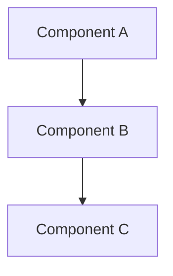

# Documentation Structure Plan for AI-Native Programming Paradigm

## Overview

This document outlines a comprehensive approach to structuring the documentation for the AI-Native Programming Paradigm project. The goal is to create a system that balances ease of editing, navigability, version control, and collaboration efficiency while using GitHub as the underlying repository.

## Documentation Architecture

### Repository Structure

```
ai-native-paradigm/
├── README.md                     # Project overview and quick start
├── mkdocs.yml                    # MkDocs configuration
├── CONTRIBUTING.md               # Contribution guidelines
└── docs/                         # All documentation files
    ├── index.md                  # Documentation home page
    ├── getting-started/          # Onboarding materials
    │   ├── overview.md           # Conceptual introduction
    │   ├── installation.md       # Setup instructions
    │   └── contributing.md       # How to contribute
    ├── roadmap/                  # Project roadmap
    │   ├── overview.md           # Roadmap summary
    │   ├── current-state.md      # Analysis of current state
    │   ├── target-state.md       # Vision for target state
    │   ├── phase1-foundation.md  # Phase 1 details
    │   ├── phase2-core.md        # Phase 2 details
    │   ├── phase3-tooling.md     # Phase 3 details
    │   ├── phase4-integration.md # Phase 4 details
    │   ├── phase5-scaling.md     # Phase 5 details
    │   └── phase6-ecosystem.md   # Phase 6 details
    ├── technical/                # Technical specifications
    │   ├── code-representation/  # Optimized code representation
    │   │   ├── overview.md       # Concept overview
    │   │   ├── format.md         # Format specifications
    │   │   └── metadata.md       # Metadata specifications
    │   ├── ai-engine/            # AI generation engine
    │   │   ├── architecture.md   # System architecture
    │   │   ├── interfaces.md     # API specifications
    │   │   └── security.md       # Security considerations
    │   ├── human-interface/      # Human interface layer
    │   │   ├── visualization.md  # Code visualization
    │   │   ├── editing.md        # Modification workflows
    │   │   └── explanation.md    # Explainability features
    │   └── execution/            # Execution environment
    │       ├── runtime.md        # Runtime specifications
    │       └── integration.md    # System integration
    ├── tooling/                  # Development tools
    │   ├── version-control.md    # VCS for optimized code
    │   ├── debugging.md          # Debugging approach
    │   ├── testing.md            # Testing framework
    │   └── documentation.md      # Documentation system
    ├── challenges/               # Challenge analysis
    │   ├── technical.md          # Technical challenges
    │   ├── human-factors.md      # Human factors challenges
    │   ├── integration.md        # Integration challenges
    │   └── solutions.md          # Proposed solutions
    ├── implementation/           # Implementation strategy
    │   ├── domain-expansion.md   # Domain expansion strategy
    │   ├── transition.md         # Transition approach
    │   └── feedback.md           # Feedback mechanisms
    └── vision/                   # Long-term vision
        ├── intent-driven.md      # Intent-driven development
        ├── collaborative.md      # Collaborative intelligence
        ├── optimization.md       # Continuous optimization
        └── democratization.md    # Knowledge democratization
```

### Cross-Linking Strategy

1. **Relative Links**
   - Use standard Markdown links with relative paths
   - Example: `[AI Engine Architecture](../../technical/ai-engine/architecture.md)`

2. **Section Anchors**
   - Use heading IDs for deep linking to specific sections
   - Example: `[Code Representation Format](../technical/code-representation/format.md#binary-structure)`

3. **Navigation Support**
   - Implement "Previous/Next" navigation in MkDocs 
   - Include "Related Topics" sections at the end of each document
   - Create "See Also" boxes for important cross-references

## Tool Setup: MkDocs with Material Theme

### Installation and Configuration

1. **Install MkDocs and the Material theme**
   ```bash
   pip install mkdocs-material
   ```

2. **Create MkDocs configuration file (mkdocs.yml)**
   ```yaml
   site_name: AI-Native Programming Paradigm
   site_description: Documentation for the AI-Native Programming Paradigm project
   repo_url: https://github.com/your-org/ai-native-paradigm
   edit_uri: edit/main/docs/

   theme:
     name: material
     features:
       - navigation.tabs
       - navigation.sections
       - navigation.top
       - search.highlight
       - content.tabs.link
     palette:
       - scheme: default
         primary: indigo
         accent: indigo
         toggle:
           icon: material/weather-night
           name: Switch to dark mode
       - scheme: slate
         primary: indigo
         accent: indigo
         toggle:
           icon: material/weather-sunny
           name: Switch to light mode

   markdown_extensions:
     - admonition
     - pymdownx.details
     - pymdownx.superfences
     - pymdownx.tabbed
     - pymdownx.keys
     - pymdownx.highlight
     - pymdownx.inlinehilite
     - attr_list
     - md_in_html
     - toc:
         permalink: true
         toc_depth: 3

   plugins:
     - search
     - mermaid2

   nav:
     - Home: index.md
     - Getting Started:
       - Overview: getting-started/overview.md
       - Installation: getting-started/installation.md
       - Contributing: getting-started/contributing.md
     - Roadmap:
       - Overview: roadmap/overview.md
       - Current State: roadmap/current-state.md
       - Target State: roadmap/target-state.md
       - Phase 1: Foundation: roadmap/phase1-foundation.md
       - Phase 2: Core Technology: roadmap/phase2-core.md
       - Phase 3: Development Tooling: roadmap/phase3-tooling.md
       - Phase 4: Integration: roadmap/phase4-integration.md
       - Phase 5: Scaling: roadmap/phase5-scaling.md
       - Phase 6: Ecosystem: roadmap/phase6-ecosystem.md
     # Additional navigation items...
   ```

3. **GitHub Pages Integration**
   Create a GitHub Actions workflow file at `.github/workflows/documentation.yml`:
   
   ```yaml
   name: documentation
   
   on:
     push:
       branches:
         - main
   
   jobs:
     deploy:
       runs-on: ubuntu-latest
       steps:
         - uses: actions/checkout@v2
         - uses: actions/setup-python@v2
           with:
             python-version: 3.x
         - run: pip install mkdocs-material
         - run: mkdocs gh-deploy --force
   ```

### Local Development Workflow

1. **Preview documentation locally**
   ```bash
   mkdocs serve
   ```

2. **Build static site**
   ```bash
   mkdocs build
   ```

3. **Deploy to GitHub Pages (manual option)**
   ```bash
   mkdocs gh-deploy
   ```

## Document Templates

### Standard Document Template

```markdown
# Document Title

## Overview

Brief description of what this document covers.

## Section 1

Content for section 1.

### Subsection 1.1

Content for subsection 1.1.

## Section 2

Content for section 2.

## Related Topics

- [Related Topic 1](path/to/related1.md)
- [Related Topic 2](path/to/related2.md)

## References

1. [Reference 1](url)
2. [Reference 2](url)
```

### Technical Specification Template

```markdown
# Component Name

## Overview

Brief description of the component and its purpose.

## Specifications

### Functional Requirements

- Requirement 1
- Requirement 2

### Technical Requirements

- Requirement 1
- Requirement 2

## Design

### Architecture

Architectural description, possibly with diagrams.



### Interfaces

API descriptions, data models, etc.

## Implementation Considerations

Notes on implementation approach, challenges, etc.

## Related Components

- [Component 1](path/to/component1.md)
- [Component 2](path/to/component2.md)
```

## Document Maintenance Guidelines

1. **Versioning**
   - Documentation versioning should follow project versioning
   - Use GitHub tags to mark documentation versions
   - Consider using version selectors in MkDocs for multiple versions

2. **Document Lifecycle**
   - Draft: Initial creation, marked with "DRAFT" watermark
   - Review: Peer review process, marked with "REVIEW" 
   - Approved: Final version, no watermark
   - Archived: Outdated documentation, marked with "ARCHIVED"

3. **Update Process**
   - Regular review schedule for each document
   - Change log section for tracking major updates
   - Clear ownership assignments for each document

4. **Style Guide**
   - Consistent terminology list
   - Writing style guidelines (voice, tense, etc.)
   - Standard formatting for code blocks, notes, warnings

## Collaboration Workflow

1. **Document Creation**
   - Create issue in GitHub describing needed documentation
   - Fork repository or create branch for new document
   - Use template to draft document
   - Submit pull request for review

2. **Document Review**
   - Automated checks for formatting and links
   - Technical review by subject matter experts
   - Editorial review for clarity and consistency
   - Address comments and iterate

3. **Document Publication**
   - Merge to main branch
   - Automatic deployment via GitHub Actions
   - Announcement of new/updated documentation

## Advantages of This Approach

1. **Modularity**: Each component has its own document or set of documents
2. **Discoverability**: Structured navigation and search capabilities
3. **Collaboration**: Multiple contributors can work on different sections
4. **Version Control**: Full history and blame information available
5. **Accessibility**: Markdown is readable in many contexts, including GitHub UI
6. **Continuous Deployment**: Documentation updates automatically as changes are merged

## Getting Started

To implement this documentation structure:

1. Clone the repository
2. Install MkDocs and the Material theme
3. Copy the configuration from this document
4. Create the folder structure
5. Begin with index.md and key overview documents
6. Gradually build out the detailed documentation

This approach provides a solid foundation that can scale with the project's complexity while maintaining ease of navigation and editing.