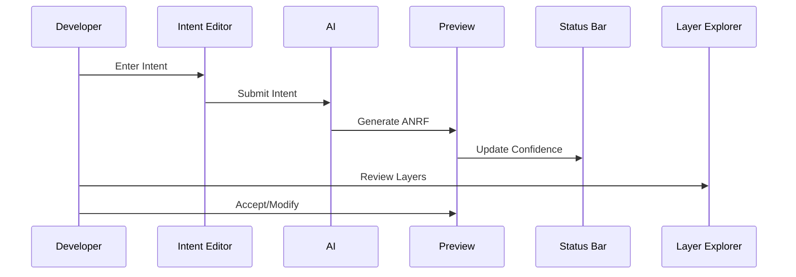
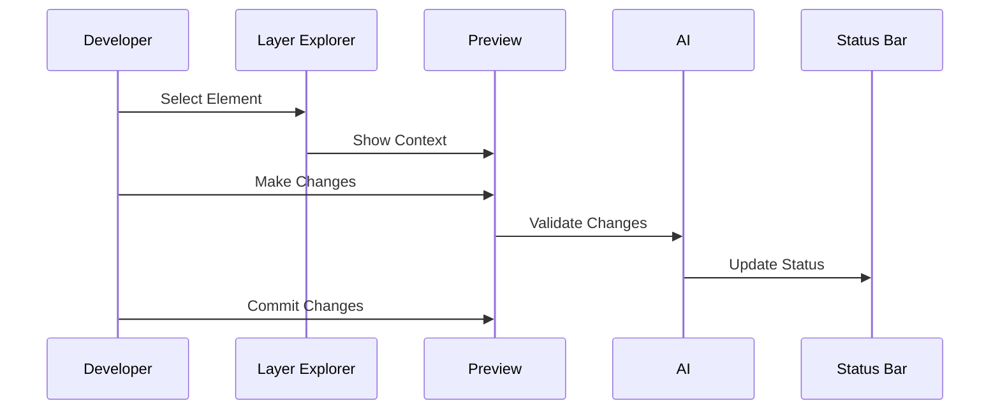
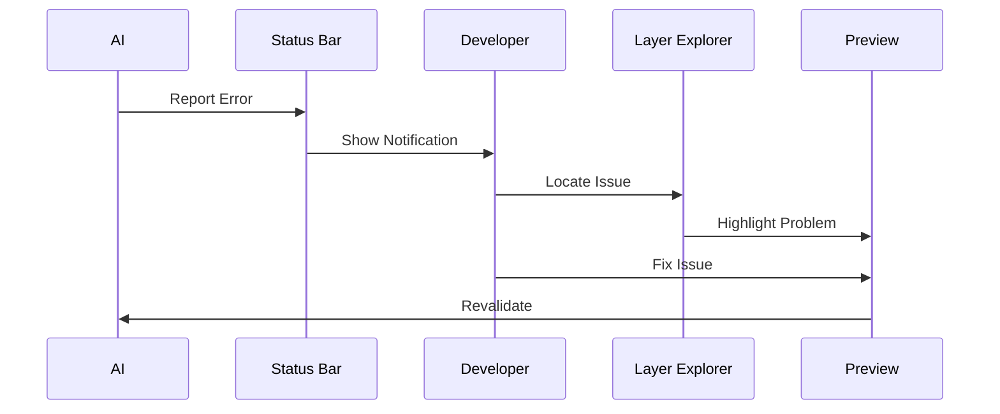

# AI-Native Programming Paradigm Interaction Model - Phase 1

This document defines the interaction model for Phase 1 (Internal Dogfooding) of the AI-Native Programming Paradigm, specifying how developers interact with the AI and optimized code through the IDE plugin.

## Core Interaction Principles

1. **Layer-Centric Navigation**: Organize interactions around the three-layer ANRF architecture
2. **Progressive Disclosure**: Reveal complexity gradually as needed
3. **Bidirectional Control**: Enable both AI-driven and developer-driven workflows
4. **Visual Consistency**: Maintain clear visual language across all interactions
5. **Immediate Feedback**: Provide real-time validation and confidence information

## IDE Plugin Layout

```
┌─────────────────────────────────────────────┐
│ Command Bar                                 │
│ [Intent Input] [Generate] [Validate] [View] │
├─────────────────────────────────────────────┤
│ ┌─────────────┐ ┌─────────────┐            │
│ │   Intent    │ │  Preview    │            │
│ │   Editor    │ │   Panel     │            │
│ │             │ │             │            │
│ └─────────────┘ └─────────────┘            │
├─────────────────────────────────────────────┤
│ ┌─────────────────────────────────────────┐ │
│ │            Layer Explorer               │ │
│ │ [Intent] [Semantic] [Execution] [Links] │ │
│ └─────────────────────────────────────────┘ │
├─────────────────────────────────────────────┤
│ Status Bar                                  │
│ [Confidence Score] [Validation] [Messages]  │
└─────────────────────────────────────────────┘
```

## Component Specifications

### 1. Command Bar

#### Intent Input
- Natural language input field for describing desired functionality
- Auto-completion for common patterns and constraints
- Quick access to recent/saved intents
- Support for structured intent templates

#### Action Buttons
- **Generate**: Triggers AI code generation
- **Validate**: Performs format and semantic validation
- **View**: Switches between visualization modes

### 2. Intent Editor

#### Features
- Syntax highlighting for intent specification
- Real-time validation feedback
- Constraint definition interface
- Tag management
- Property editor

#### Layout
```
┌─────────────────────────────────┐
│ Intent Type: [Dropdown ▼]       │
├─────────────────────────────────┤
│ Description:                    │
│ [Multiline Input         ]      │
├─────────────────────────────────┤
│ Constraints:                    │
│ + [Add Constraint]             │
│ - Performance: O(n)            │
│ - Safety: Handle empty arrays  │
├─────────────────────────────────┤
│ Tags: [math] [array] [utility] │
└─────────────────────────────────┘
```

### 3. Preview Panel

#### Features
- Real-time preview of generated code
- Interactive visualization of all three layers
- Confidence score indicators
- Link highlighting on hover

#### Visualization Modes
1. **Unified View**: All layers with relationships
2. **Layer Focus**: Detailed view of selected layer
3. **Diff View**: Changes from previous version
4. **Traditional Code**: Human-readable projection

### 4. Layer Explorer

#### Intent Layer Tab
- Intent hierarchy visualization
- Constraint relationship view
- Tag-based navigation
- Property inspector

#### Semantic Layer Tab
- Interactive node-link diagram
- Type hierarchy visualization
- Symbol table explorer
- Reference tracker

#### Execution Layer Tab
- Control flow visualization
- Data flow highlighting
- Performance annotations
- Debug points integration

#### Links Tab
- Cross-layer reference visualization
- Relationship matrix view
- Impact analysis tools
- Reference integrity checker

### 5. Status Bar

#### Confidence Score
- Visual indicator (0-100%)
- Confidence breakdown by component
- Historical trend view
- Threshold alerts

#### Validation Status
- Format validation results
- Semantic validation results
- Cross-reference integrity
- Custom constraint checks

#### Messages
- Error notifications
- Warning indicators
- Information updates
- Action suggestions

## Interaction Flows

### 1. Code Generation Flow



### 2. Code Modification Flow



### 3. Error Recovery Flow



## Progressive Disclosure Strategy

### Level 1: Basic Interaction
- Intent input and generation
- Simple validation feedback
- Basic layer visualization
- Confidence score display

### Level 2: Enhanced Control
- Constraint definition
- Cross-layer navigation
- Detailed validation results
- Performance insights

### Level 3: Advanced Features
- Custom visualization modes
- Impact analysis tools
- Detailed confidence metrics
- Advanced debugging features

## Error Handling

### Validation Errors
- Immediate visual feedback
- Clear error messages
- Suggested fixes
- Context-sensitive help

### AI Generation Issues
- Fallback options
- Alternative suggestions
- Manual override paths
- Recovery guidance

### User Input Problems
- Real-time validation
- Auto-correction suggestions
- Format guidance
- Example references

## Feedback Mechanisms

### Visual Feedback
- Color coding for confidence levels
- Progress indicators for AI operations
- Validation status icons
- Reference highlighting

### Interactive Feedback
- Hover tooltips with details
- Click-through explanations
- Drag-drop layer navigation
- Context menus for actions

### System Feedback
- Operation success/failure notices
- Performance metrics
- Resource usage indicators
- System status updates

## Keyboard Shortcuts

### Navigation
- `Ctrl+1/2/3`: Switch layers
- `Ctrl+L`: Toggle link view
- `Ctrl+F`: Find in current layer
- `Alt+←/→`: Navigate history

### Operations
- `Ctrl+G`: Generate from intent
- `Ctrl+V`: Validate current state
- `Ctrl+S`: Save changes
- `Ctrl+Z`: Undo operation

## Phase 1 Implementation Notes

### Priority Features
1. Basic intent input and generation
2. Three-layer visualization
3. Essential validation feedback
4. Simple confidence scoring
5. Basic error handling

### Deferred Features
1. Advanced visualization modes
2. Detailed impact analysis
3. Custom constraint definitions
4. Historical trend analysis

### Integration Points
1. VSCode extension API
2. ANRF parsing library
3. AI service endpoints
4. Validation service

## Change Log
- 2025-04-07: Created Phase 1 interaction model specification
