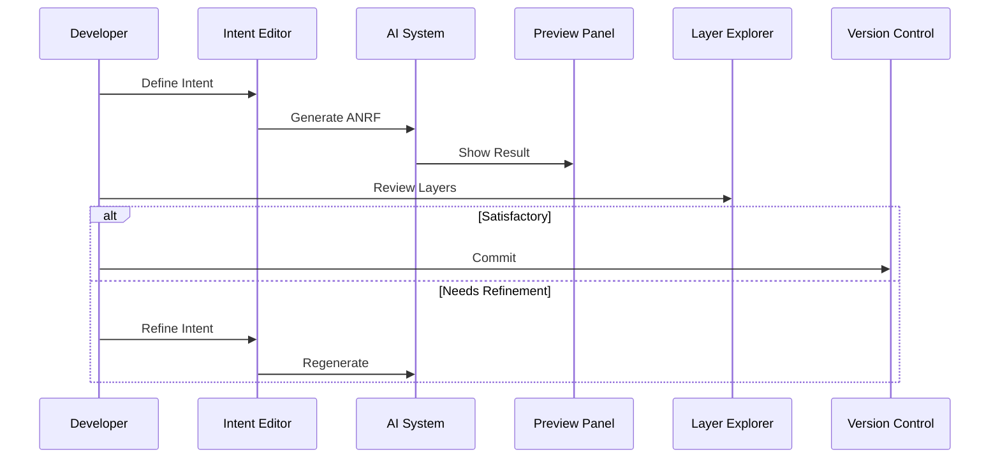
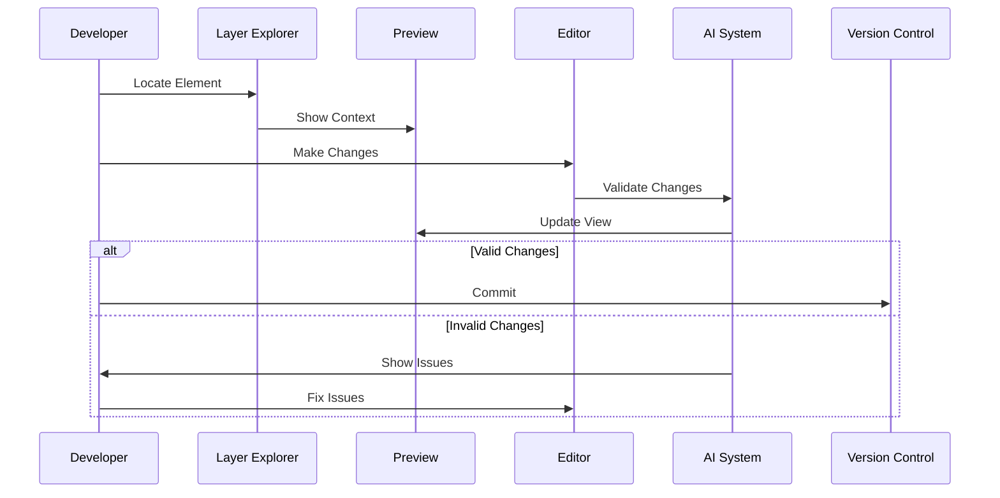
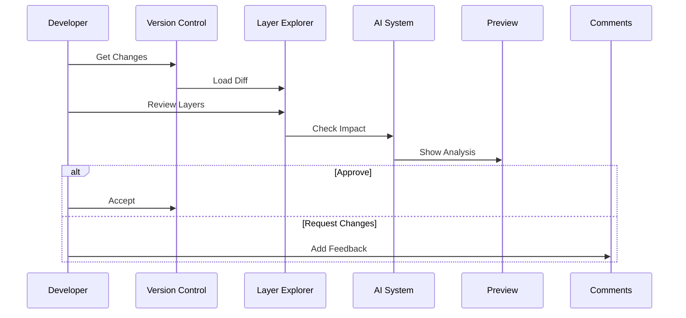
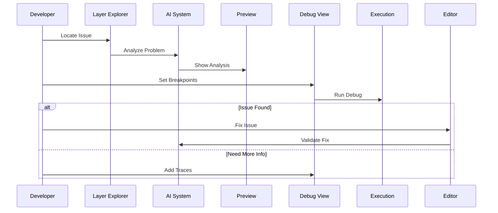

# AI-Native Programming Paradigm Workflow Design - Phase 1

This document defines the workflow design for Phase 1 (Internal Dogfooding) of the AI-Native Programming Paradigm, specifying how developers interact with the system through common task sequences.

## Core Workflow Principles

1. **Intent-Driven Development**: Start with clear intent description
2. **Progressive Refinement**: Iterative improvement of generated code
3. **Layered Navigation**: Natural movement between abstraction levels
4. **Verification Integration**: Continuous validation throughout workflow
5. **Collaborative Iteration**: Effective human-AI interaction patterns

## Primary Workflows

### 1. New Feature Development



#### Stage Details

1. **Intent Definition**
   - Open Intent Editor
   - Select intent type (function, class, module)
   - Write description
   - Define constraints
   - Add tags and properties

2. **Generation Review**
   - View confidence score
   - Check validation results
   - Examine all three layers
   - Verify cross-references

3. **Refinement (if needed)**
   - Adjust constraints
   - Clarify description
   - Add specific requirements
   - Request alternatives

4. **Acceptance**
   - Run final validation
   - Add documentation
   - Commit to version control

### 2. Code Modification



#### Stage Details

1. **Element Location**
   - Navigate to target layer
   - Use search/filter
   - Follow references
   - View relationships

2. **Context Understanding**
   - View related elements
   - Check dependencies
   - Review constraints
   - Understand impact

3. **Change Implementation**
   - Select modification type
   - Make changes
   - Request AI assistance
   - Preview results

4. **Validation**
   - Check structural validity
   - Verify semantics
   - Review confidence
   - Assess impact

### 3. Code Review



#### Stage Details

1. **Change Loading**
   - Load diff view
   - See layer changes
   - View relationships
   - Check metrics

2. **Impact Analysis**
   - Review confidence changes
   - Check constraint compliance
   - Verify relationships
   - Assess performance

3. **Detailed Review**
   - Examine each layer
   - Verify cross-references
   - Check style compliance
   - Review documentation

4. **Feedback Provision**
   - Add comments
   - Request changes
   - Suggest improvements
   - Approve changes

### 4. Debugging



#### Stage Details

1. **Issue Location**
   - Navigate to problem area
   - View error context
   - Check related elements
   - Review state

2. **Analysis**
   - Run AI analysis
   - View trace data
   - Check relationships
   - Examine state

3. **Investigation**
   - Set breakpoints
   - Add watch expressions
   - Step through execution
   - Inspect variables

4. **Resolution**
   - Apply fix
   - Validate changes
   - Verify solution
   - Update tests

## Progressive Disclosure Strategy

### Level 1: Basic Workflows
- Intent definition and generation
- Simple modifications
- Basic review process
- Error reporting

### Level 2: Enhanced Workflows
- Constraint refinement
- Impact analysis
- Detailed debugging
- Performance optimization

### Level 3: Advanced Workflows
- Complex refactoring
- Cross-module changes
- Advanced optimization
- Custom workflows

## Error Recovery Patterns

### Validation Errors
1. Show error details
2. Highlight problem areas
3. Suggest fixes
4. Guide resolution

### Generation Issues
1. Display confidence issues
2. Show alternative options
3. Allow intent refinement
4. Enable manual override

### Runtime Problems
1. Capture error context
2. Show execution state
3. Enable step-back
4. Suggest corrections

## Feedback Loops

### Immediate Feedback
- Syntax validation
- Constraint checking
- Reference verification
- Style compliance

### Asynchronous Feedback
- Performance analysis
- Impact assessment
- Security scanning
- Quality metrics

## Keyboard Shortcuts

### Navigation
```
Ctrl+I: Open Intent Editor
Ctrl+L: Switch Layer
Ctrl+F: Find in Layer
Alt+B: Toggle Breakpoint
```

### Operations
```
Ctrl+G: Generate
Ctrl+R: Refine
Ctrl+V: Validate
Ctrl+D: Debug
```

## Phase 1 Implementation Notes

### Priority Workflows
1. Basic intent-to-code generation
2. Simple code modification
3. Essential debugging
4. Basic code review

### Deferred Workflows
1. Complex refactoring
2. Cross-module optimization
3. Advanced debugging
4. Custom workflow creation

### Integration Points
1. Version control system
2. CI/CD pipeline
3. Testing framework
4. Documentation system

### Success Metrics
1. Generation confidence scores
2. Error resolution times
3. Review efficiency
4. Developer satisfaction

## Change Log
- 2025-04-07: Created Phase 1 workflow design specification